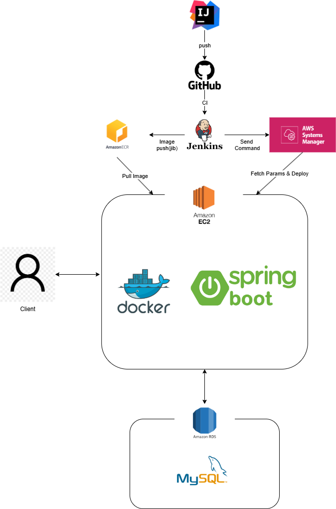
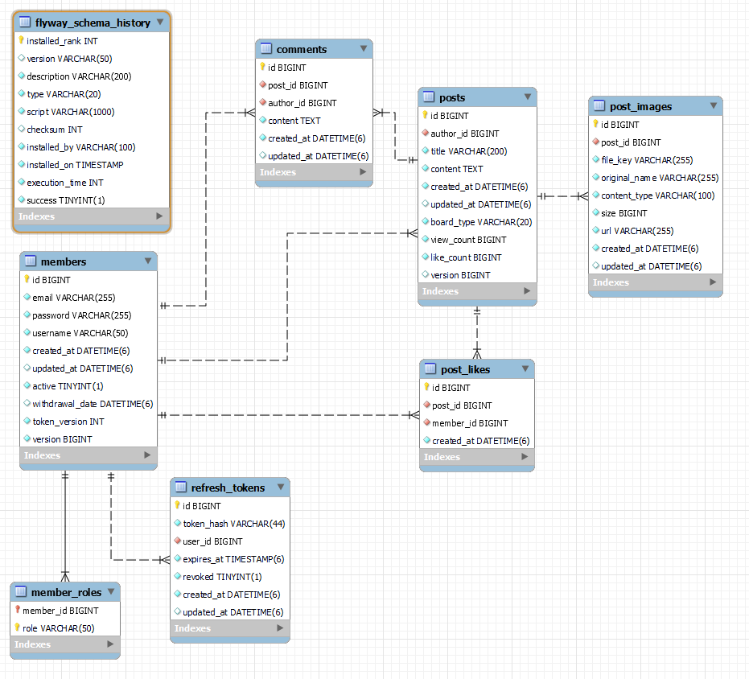

# 커뮤니티 포트폴리오 프로젝트

## 📌 프로젝트 개요

이 프로젝트는 게시글, 댓글, 좋아요 기능을 갖춘 확장 가능한 커뮤니티 플랫폼을 구현한 Spring Boot 백엔드 애플리케이션입니다. 사용자 인증, 게시글 관리, 파일 업로드, 게시글 필터링 등 다양한 기능을 제공합니다.

## Swagger(OpenAPI) 문서 안내

이 프로젝트는 springdoc-openapi를 사용하여 API 명세를 자동으로 제공합니다.

- **Swagger UI**: [http://localhost:8080/swagger-ui.html](http://localhost:8080/swagger-ui.html)
- **OpenAPI 명세(JSON)**: [http://localhost:8080/v3/api-docs/v1](http://localhost:8080/v3/api-docs/v1)
  - `/api/**` 경로의 모든 엔드포인트가 문서화되어 있습니다.

Swagger UI를 통해 API 테스트 및 명세 확인이 가능합니다.

---

## 📊 시스템 아키텍처

- **Backend**: Java 21, Spring Boot 3.5.4
- **보안**: Spring Security, JWT 인증
- **데이터베이스**: MySQL, JPA, Flyway(마이그레이션)
- **빌드 도구**: Gradle
- **테스트**: JUnit 5, Mockito, H2(인메모리 DB)
- **배포 인프라**: 
  - **컨테이너화**: Docker
  - **CI/CD**: Jenkins
  - **클라우드**: AWS (EC2, RDS, ECR, SSM)

  
## 🗄️ 데이터베이스 ERD

## 🔑 핵심 기능

### 1. 사용자 관리 및 인증

- **회원가입/로그인**: 이메일 기반 회원가입 및 로그인
- **보안 강화된 인증 시스템**:
  - JWT를 이용한 액세스 토큰 & 리프레시 토큰 구현
  - 쿠키 기반 리프레시 토큰 저장
  - 토큰 재사용 감지 메커니즘 구현
  - CSRF 보호를 위한 X-Requested-With 헤더 검증
  - Origin 헤더 검증을 통한 CORS 보안 강화
  - 계정 활성화 상태 관리 (회원 탈퇴 시 비활성화 처리)

### 2. 게시판 시스템

- **다양한 게시판 타입**: 자유게시판, 공지사항 지원
- **게시글 관리**: 생성, 조회, 수정, 삭제(CRUD) 기능
- **이미지 업로드**: 게시글에 여러 이미지 첨부 가능
- **게시글 필터링**:
  - 인기 게시글(좋아요 10개 이상)
  - 베스트 게시글(좋아요 30개 이상)
  - 최소 좋아요 수 기준 필터링(사용자 정의)
  - 최근 추천 게시글(기간 내 좋아요 많은 글)
  - 게시판 타입별 필터링
  - 검색어 기반 필터링

### 3. 이미지 처리

- **파일 저장소 추상화**: 로컬 저장소 지원
- **보안 검증**: 파일 소유권 및 경로 검증으로 안전한 이미지 업로드
- **트랜잭션 동기화**: 게시글 삭제 시 연관 이미지 파일 자동 정리

### 4. 인터랙션 기능

- **좋아요 시스템**: 게시글 좋아요/좋아요 취소 기능
- **댓글 시스템**: 게시글에 댓글 작성 및 관리
- **최적화된 댓글 조회**: DTO 프로젝션을 활용한 N+1 문제 해결
- **조회수 관리**: 낙관적 락 충돌 방지를 위한 별도 쿼리 처리

### 4. 보안 및 성능 최적화

- **낙관적 락**: 동시성 제어를 위한 버전 관리
- **페이지네이션**: 대량의 데이터 처리를 위한 페이징 구현
- **입력값 검증**: 모든 API 요청에 대한 유효성 검사
- **SQL 인젝션 방지**: JPA를 통한 안전한 쿼리 구성
- **XSS 방지**: Content Security Policy 적용

### 5. CI/CD 파이프라인

- **Jenkins 파이프라인**: 지속적 통합 및 배포 자동화
- **배포 자동화**: 단일 체크박스로 전체 배포 프로세스 자동화
- **AWS SSM 파라미터 스토어**: 보안 정보와 환경 변수 안전한 관리
- **Docker 컨테이너화**: 일관된 환경에서의 애플리케이션 실행
- **ECR 레지스트리**: 컨테이너 이미지 안전한 저장 및 배포

### 데이터베이스 설계

- **members**: 회원 정보
- **posts**: 게시글 정보
- **comments**: 댓글 정보
- **post_likes**: 게시글 좋아요 정보
- **post_images**: 게시글 이미지 정보
- **refresh_tokens**: 리프레시 토큰 관리
- **member_roles**: 회원 권한 정보

## 🚀 API 주요 엔드포인트

### 인증 관련 API

- `POST /api/auth/signup`: 회원가입
- `POST /api/auth/login`: 로그인
- `POST /api/auth/refresh`: 토큰 갱신
- `POST /api/auth/logout`: 로그아웃

### 게시글 관련 API

- `GET /api/posts/summary`: 게시글 목록 조회
- `GET /api/posts/filter/summary`: 최소 좋아요 수 기준 게시글 필터링
- `GET /api/posts/popular/summary`: 인기 게시글 조회 (좋아요 10개 이상)
- `GET /api/posts/best/summary`: 베스트 게시글 조회 (좋아요 30개 이상)
- `GET /api/posts/recommended/summary`: 최근 추천 게시글 조회 (사용자 정의 ex:최근 일주일)
- `GET /api/posts/board/{boardType}/summary`: 게시판 타입별 게시글 조회
- `GET /api/posts/{id}`: 게시글 상세 조회
- `POST /api/posts`: 게시글 생성
- `PUT /api/posts/{id}`: 게시글 수정
- `DELETE /api/posts/{id}`: 게시글 삭제

### 댓글 관련 API

- `GET /api/posts/{postId}/comments`: 특정 게시글의 댓글 목록 조회
- `POST /api/posts/{postId}/comments`: 댓글 작성
- `PUT /api/comments/{id}`: 댓글 수정
- `DELETE /api/comments/{id}`: 댓글 삭제

### 파일 관련 API

- `POST /api/files/posts`: 게시글 이미지 업로드
- `DELETE /api/files/posts`: 게시글 이미지 삭제

### 좋아요 관련 API

- `POST /api/posts/{id}/like`: 게시글 좋아요 토글
- `GET /api/posts/{id}/like`: 게시글 좋아요 상태 조회

### 회원 관련 API

- `GET /api/members/me`: 현재 로그인한 회원 정보 조회
- `PUT /api/members/me`: 현재 로그인한 회원 정보 수정
- `PUT /api/members/me/password`: 비밀번호 변경
- `DELETE /api/members/me`: 회원 탈퇴

## 📸 API 캡처 (Swagger / Postman)
- 자세한 캡처는 [docs/API_CAPTURE.md](docs/API_CAPTURE.md) 참고

## 🛠️ 기술적 특징

### 1. 로그인 및 인증 보안

- **JWT 인증**: 단기 액세스 토큰 + 장기 리프레시 토큰 구조
- **토큰 회전 메커니즘**: 리프레시 토큰 사용 시 새 토큰 발급(토큰 도난 대응)
- **HTTP-Only 쿠키**: XSS 공격으로부터 리프레시 토큰 보호
- **X-Requested-With 헤더 검증**: CSRF 공격 방지
- **Origin 헤더 검증**: 허용된 도메인만 접근 가능
- **보안 응답 헤더**: CSP, HSTS, X-Frame-Options, X-Content-Type-Options 적용

### 2. 동시성 제어

- **낙관적 락**: 버전 필드를 통한 동시 수정 충돌 방지
- **별도 업데이트 쿼리**: 조회수, 좋아요 수 증감 시 낙관적 락 충돌 방지
- **트랜잭션 관리**: Spring의 선언적 트랜잭션을 통한 데이터 일관성 보장

### 3. 데이터베이스 마이그레이션

- **Flyway**: 데이터베이스 스키마 변경 관리
- **버전 관리**: 스키마 변경 이력 추적 및 자동 적용
- **스키마 무결성**: 외래 키 제약 조건 및 인덱스 자동 관리

### 4. 이미지 처리

- **파일 저장소 추상화**: 로컬 저장소 지원
- **보안 검증**: 파일 소유권 및 경로 검증으로 안전한 이미지 업로드
- **트랜잭션 동기화**: 게시글 삭제 시 연관 이미지 파일 자동 정리
- **파일 경로 보안**: 경로 탈출(Path Traversal) 공격 방지 로직 구현
- **매직 넘버 검사**: 파일 시그니처 기반 MIME 타입 위조 방지
- **이미지 파일 검증**: 허용된 이미지 형식만 업로드 가능(JPEG, PNG, GIF, WebP)

### 5. 테스트 및 품질 관리

- **단위 테스트**: 주요 비즈니스 로직에 대한 JUnit5 테스트
- **통합 테스트**: Spring Boot Test를 활용한 컨트롤러 및 레포지토리 테스트
- **모의 객체(Mock)**: Mockito를 활용한 의존성 격리 테스트

### 6. 오류 처리 및 로깅

- **글로벌 예외 처리기**: 일관된 API 응답 포맷 제공
- **비즈니스 예외 분리**: 도메인별 커스텀 예외 구현
- **구조화된 로깅**: 오류 추적을 위한 상세 로그 기록
- **보안 로깅**: 민감 정보 마스킹을 통한 로그 보안 강화

### 환경 변수 설정

주요 환경 변수:
- **데이터베이스 설정**:
  - `DB_URL`: 데이터베이스 URL
  - `DB_USERNAME`: 데이터베이스 사용자명
  - `DB_PASSWORD`: 데이터베이스 비밀번호

- **JWT 인증 설정**:
  - `JWT_SECRET`: JWT 서명 키
  - `JWT_ACCESS_EXP_MS`: 액세스 토큰 만료 시간(밀리초)
  - `JWT_ISSUER`: JWT 발급자

- **리프레시 토큰 설정**:
  - `REFRESH_EXP_MS`: 리프레시 토큰 만료 시간
  - `REFRESH_COOKIE_NAME`: 리프레시 쿠키 이름
  - `REFRESH_COOKIE_PATH`: 리프레시 쿠키 경로
  - `REFRESH_COOKIE_SECURE`: 보안 쿠키 설정
  - `REFRESH_COOKIE_SAME_SITE`: SameSite 쿠키 설정

- **보안 및 접근 설정**:
  - `ALLOWED_ORIGINS`: CORS 허용 도메인 목록
  - `ENABLE_ORIGIN_VALIDATION`: Origin 헤더 검증 활성화 여부
  - `SECURITY_HASH_ALGORITHM`: 토큰 해시 알고리즘

- **관리자 계정 설정**:
  - `ADMIN_EMAIL`: 관리자 이메일
  - `ADMIN_USERNAME`: 관리자 사용자명
  - `ADMIN_PASSWORD_HASH`: 관리자 비밀번호 해시

- **파일 저장소 설정**:
  - `PUBLIC_BASE_URL`: 파일 접근 기본 URL

### CI/CD 파이프라인 구성

1. Jenkins 설정
   - Jenkins 서버에 AWS CLI 및 Docker 설치
   - AWS 자격증명 설정 (IAM 사용자 또는 역할)

2. AWS 인프라 구성
   - RDS MySQL 데이터베이스 생성
   - EC2 인스턴스 배포 대상 설정
   - ECR 리포지토리 생성
   - SSM 파라미터 스토어에 설정값 저장

3. 파이프라인 실행
   - Jenkins 파이프라인 작업 생성
   - 배포 파라미터 설정 (AWS 계정 ID, 리전, 인스턴스 ID 등)
   - 'DEPLOY' 체크박스 선택으로 원클릭 배포 실행

## 🌟 프로젝트 특징 및 장점

1. **강화된 보안**: 토큰 도난, CSRF, XSS 등 다양한 공격 시나리오 대응
2. **데이터/파일 보안**: 파일 업로드·삭제 시 TOCTOU(시간-검증-시간-사용) 공격 방지, 경로·symlink 검증 등 적용
3. **개인정보 보호**: 회원 탈퇴 시 개인정보(이메일, 비밀번호 등) 완전 익명화 및 랜덤화 처리
4. **동시성/정합성 보장**: 비관적 락(Pessimistic Lock)과 낙관적 락을 상황에 맞게 활용하여 데이터 정합성 극대화
5. **최적화된 성능**: N+1 문제 해결을 위한 EntityGraph 활용
6. **책임 분리**: 명확한 계층 구조와 책임 분리
7. **DevOps 통합**: Jenkins와 AWS 서비스를 활용한 CI/CD 파이프라인
8. **보안 설정 관리**: AWS SSM을 통한 민감 정보 안전한 관리
9. **테스트**: 단위 테스트 및 통합 테스트를 통한 품질 보증
10. **다양한 검색 및 필터링**: 사용자 요구에 맞는 다양한 게시글 조회 방식 제공

## 📈 향후 개선 계획

1. **AWS S3 스토리지 통합**: 
   - 현재 추상화된 파일 저장소 인터페이스를 활용한 S3 구현체 개발

2. **소셜 로그인**: 
   - OAuth2를 통한 소셜 미디어 로그인 통합
   - 카카오, 구글, 네이버 등 국내외 주요 서비스 지원
   - Spring Security OAuth2 Client 활용

---
© 2025 Community Portfolio Project
