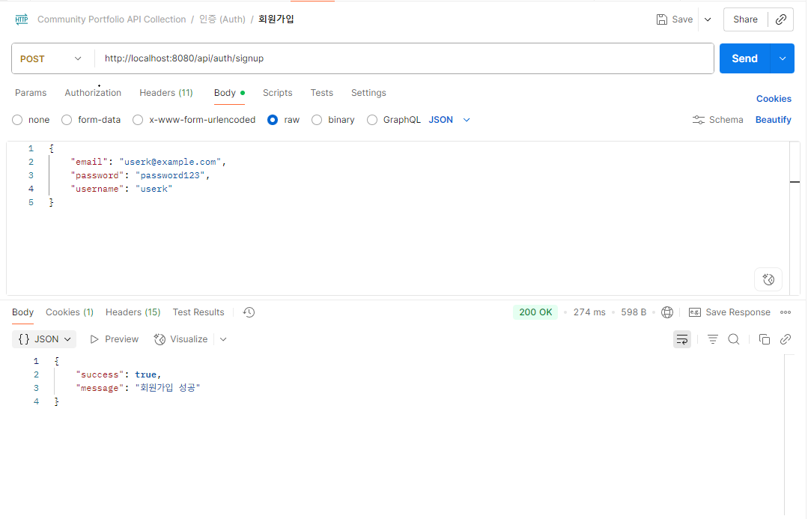

# API 동작 캡처 및 예시

이 문서는 실제 API 동작 화면(캡처)과 주요 요청/응답 예시를 정리한 자료입니다. Swagger UI, Postman 테스트 결과, 주요 엔드포인트별 JSON 예시를 포함합니다.

---

## 1. Swagger UI 캡처

- 전체 API 명세 및 테스트 가능
- JWT 인증, 게시글/댓글/회원 등 모든 엔드포인트 확인 가능

---

## 2. 회원가입/로그인/로그아웃

### 회원가입 성공

### 회원가입 실패(중복)

### 로그인 성공

### 로그인 실패

### 로그아웃 성공

---

## 3. 게시글/댓글

### 게시글 작성 (이미지 포함)

### 게시글 검색

### 게시글 상세 조회

### 게시글 수정 (성공/실패)
게시글 수정 성공: 
게시글 수정 실패(권한): 

### 댓글 작성

---

## 4. 파일 업로드/보안

### 이미지 업로드 성공

### 이미지 업로드 실패

---

## 5. 좋아요/추천

### 게시글 좋아요

---

## 6. 토큰/인증

### 토큰 재발급 성공

### 토큰 재발급 실패(로그아웃)

---

## 7. AWS

### 회원가입 성공

### 로그인 성공

### 게시글 작성

---

